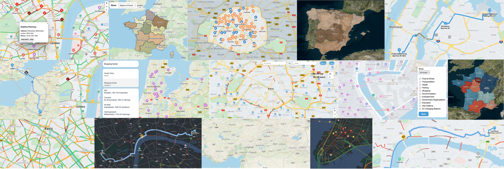
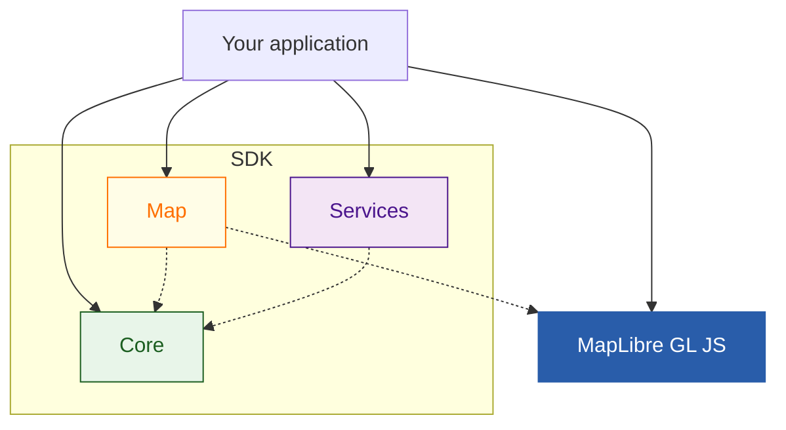

[](https://sonar.tomtomgroup.com/dashboard?id=tomtom-international_maps-sdk-js_AYHTCTXCqdbqIGrKswTc)
[](https://sonar.tomtomgroup.com/dashboard?id=tomtom-international_maps-sdk-js_AYHTCTXCqdbqIGrKswTc)
[](https://sonar.tomtomgroup.com/dashboard?id=tomtom-international_maps-sdk-js_AYHTCTXCqdbqIGrKswTc)
[](https://sonar.tomtomgroup.com/dashboard?id=tomtom-international_maps-sdk-js_AYHTCTXCqdbqIGrKswTc)

[](https://www.tomtom.com/)

# Maps SDK JS
[**Examples**](https://docs.tomtom.com/maps-sdk-js/examples/) |
[**Documentation**](https://docs.tomtom.com/maps-sdk-js/introduction/overview)

<br/>

Maps SDK JS is a **JavaScript** library for building applications using [**TomTom** location maps and services](https://docs.tomtom.com/).

[](https://docs.tomtom.com/maps-sdk-js/examples/)

It leverages the power of [MapLibre GL JS](https://github.com/maplibre/maplibre-gl-js) and [GeoJSON](https://geojson.org/)
to seamlessly integrate TomTom maps and services with convenient out-of-the-box support, while staying highly customizable and extensible.
<br/><br/>

## 🚀 Getting Started using npm
```
npm i @tomtom-org/maps-sdk-js
```

Additionally:
* If you use the map: ```npm i maplibre-gl```

(Learn more below)
<br/><br/>

## 📚 Documentation & Examples

Explore comprehensive guides and interactive examples to get the most out of Maps SDK JS:

### 🚀 Interactive Examples
- **[Live Examples](https://docs.tomtom.com/maps-sdk-js/examples/)** - Try the SDK in your browser

### 📖 Documentation
- **[Getting Started Guide](https://docs.tomtom.com/maps-sdk-js/introduction/overview)** - Introduction and key features
- **[Project Setup](https://docs.tomtom.com/maps-sdk-js/introduction/project-setup)** - Step-by-step setup instructions
- **[Map Guides](https://docs.tomtom.com/maps-sdk-js/guides/map/)** - Display and configure interactive maps
- **[Services Guides](https://docs.tomtom.com/maps-sdk-js/guides/services/)** - Search, routing, and geocoding
- **[Core Utilities](https://docs.tomtom.com/maps-sdk-js/guides/core/)** - Common configurations and utilities

### 📋 API Reference
- **[API Reference](https://docs.tomtom.com/maps-sdk-js/reference/overview)** - Complete API documentation

### 📝 Latest Updates
- **[Release Notes](https://docs.tomtom.com/maps-sdk-js/overview/release-notes)** - What's new and breaking changes
<br/><br/><br/>

## 🌍 Where can you run it on?
* **web**: display and configure a map, search for places, plan routes, and easily display and interact with them, including your own data
* **nodejs**: (reverse)geocode locations, (re)calculate routes, and more, to enrich data before saving or returning it
* **React Native**: leverage the power of TomTom location services from a single codebase
<br/><br/>

## 📦 Bundles


* [Map](#map): MapLibre-powered library for readily styled, service-compatible and interactive TomTom Maps
* * [MapLibre](https://maplibre.org/maplibre-gl-js/docs/) is an open source peer dependency so your application can also use it directly
* [Services](#services): Functions with GeoJSON services for TomTom location APIs
* * Compatible with web, nodejs and React Native applications
* [Core](#core): shared configuration, types and utilities
* * Facilitates seamless integration between map and services

## 🗺️ Map
The SDK [Map bundle](https://developer-staging.tomtom.com/maps-sdk-js/api-reference/home#map-modules) is built on top of [MapLibre GL JS](https://maplibre.org/maplibre-gl-js/docs/), and shares it as a dependency with your app.\
You can both use the TomTom and MapLibre SDKs together at any time.

### ✨ Feature highlights
Readily available, yet highly customizable interactive TomTom Maps:
* in different styles: light, dark, b&w, satellite
* with configurable POIs and Live Traffic
* seamlessly integrable with TomTom [Services](#services)
* with places, routes and geometries from TomTom services or your own data

### 🚀 Getting Started with Map
#### Using npm
The SDK Map uses [MapLibre GL JS](https://www.npmjs.com/package/maplibre-gl) as peer dependency.
Therefore, you need to also have it installed in your project.\
The TomTom SDK is tested against the latest stable [release of MapLibre GL](https://github.com/maplibre/maplibre-gl-js/blob/main/CHANGELOG.md).
```
npm i @tomtom-org/maps-sdk-js maplibre-gl
```
Code imports from the SDK Map Bundle will come from ```@tomtom-org/maps-sdk-js/map```
<br/><br/>

## 🔧 Services
The SDK [Services bundle](https://developer-staging.tomtom.com/maps-sdk-js/api-reference/home#service-modules) integrates the TomTom location APIs into comprehensive [GeoJSON](https://geojson.org/) services.\
The services can be integrated in **web**, [nodejs](https://nodejs.org/) and [React Native](https://reactnative.dev/) apps.\
The compatibility of both inputs and outputs with [GeoJSON](https://geojson.org/) helps with further integration with geospatial tools.

### ✨ Feature highlights
* [Search](https://developer-staging.tomtom.com/maps-sdk-js/api-reference/search) (fuzzy search, geometry search)
* [Geocoding](https://developer-staging.tomtom.com/maps-sdk-js/api-reference/geocoding) and [Reverse Geocoding](https://developer-staging.tomtom.com/maps-sdk-js/api-reference/reverse-geocoding)
* [Geometry Data](https://developer-staging.tomtom.com/maps-sdk-js/api-reference/geometry-data)
* [Routing](https://developer-staging.tomtom.com/maps-sdk-js/api-reference/calculate-route) with EV support
* EV Charging Stations Availability

### 🚀 Getting Started with Services
#### Using npm
```
npm i @tomtom-org/maps-sdk-js
```
Code imports from the SDK Map Bundle will come from ```@tomtom-org/maps-sdk-js/services```
<br/><br/>

## ⚙️ Core
The SDK [Core](https://developer-staging.tomtom.com/maps-sdk-js/api-reference/core)
is a set of utilities and TypeScript types which are common to both [Map](#map) and [Services](#services).`

### ✨ Feature highlights
* [Common configuration](https://developer-staging.tomtom.com/maps-sdk-js/api-reference/core.TomTomConfig)
* Common types (such as outputs from Services which can be used as inputs to the Map)
* Utilities (such as distance/duration formatting and bounding box calculations)

### 🔧 Using the Core Bundle
If you use Map and/or Services, there is no need to install any further packages.\
Code imports from the SDK Core Bundle will come from ```@tomtom-org/maps-sdk-js/core```
