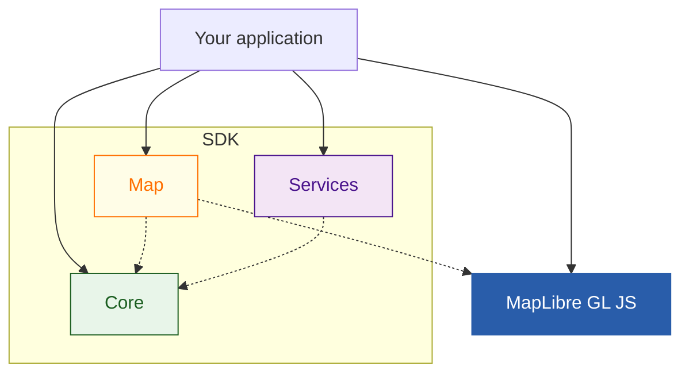

## Overview

The Maps SDK for JavaScript is built around two core capabilities that can work independently or together:

1. **Map display and interaction** - Render and interact with TomTom maps in your web applications
2. **Location-based services** - Access TomTom's APIs for search, routing, geocoding, and more

This flexible architecture allows you to use only what you need, whether that's displaying maps, accessing location services, or combining both for full-featured mapping applications.

### Map display and interaction

Render TomTom interactive maps in your web applications with:

- **Map rendering**: Display maps with predefined styles (light, dark, satellite) or create custom ones
- **Map customization**: Control traffic display, POIs, labels, and other map elements
- **User interaction**: Pan, zoom, rotate, and interact with map elements and TomTom data
- **TomTom data integration**: Seamlessly display places, routes, and geometries from TomTom services. Thanks to the Core bundle, such data is also fully compatible with the Services bundle.
- **Custom data**: Add and manage your own markers, shapes, and layers

### Location-based services

Access TomTom's location APIs with:

- **GeoJSON support**: All TomTom services return data in standard GeoJSON format. Thanks to the Core bundle, such data is also fully compatible with the Map bundle.
- **Multi-platform support**: Use in web browsers, Node.js servers, and React Native applications

## Architecture

The SDK is organized into three modular bundles for flexibility and maintainability:

- **[Map](#map)** - Interactive map rendering and TomTom-specific features
- **[Services](#services)** - Location-based API functions
- **[Core](#core)** - Shared configuration, types, and utilities

This separation enables tree-shaking, keeping your application lightweight by including only the features you use.

## Map

The **Map** bundle handles all map rendering and interaction in the browser, built on top of [MapLibre GL JS](./map/about-maplibre.mdx) for high-performance, customizable map experiences.

While MapLibre provides the rendering foundation, the Map bundle enhances it with TomTom-specific features and seamless integrations.

### Map foundations

1. **[TomTomMap](./map/tomtom-map.mdx)**: A lightweight wrapper around MapLibre's `Map` class that simplifies initialization with TomTom configurations, styles, and optimizations
2. **[Modules](./map/modules.mdx)**: Tree-shakable components that extend TomTomMap functionality, allowing you to include only what you need

This modular design promotes tree-shaking, since your code only includes the modules you use.

You can learn more about the Map bundle in the [Map Introduction Guide](./map/introduction.mdx).

## Services

The **Services** bundle provides easy-to-use functions that integrate with [TomTom's JSON APIs](https://docs.tomtom.com/), enabling powerful location-based features:

- **Geocoding**: Convert [addresses to coordinates](./services/places/geocoding.mdx) and [vice versa](./services/places/reverse-geocoding.mdx)
- **Search**: [Find places, POIs, and addresses](./services/places/search.mdx) with flexible query options
- **Routing**: [Calculate routes](./services/routing/quickstart.mdx) with alternatives and traffic-aware options

### Service key features

- **GeoJSON format**: All services return data in standard GeoJSON, making integration simple
- **Developer-friendly**: Consistent API design across all services
- **Platform-agnostic**: Works in browsers, Node.js, and React Native
- **Independent**: Use without the Map bundle for backend or non-visual applications

The Services bundle is perfect for server-side applications, CLI tools, or any scenario where you need location data without map visualization.

## Core

The **Core** bundle acts as the foundation that connects the Map and Services bundles, containing:

- **Common configuration**: Set properties like API key and language once, shared across Map and Services
- **Shared types**: Common TypeScript types and interfaces used throughout the SDK
- **Utilities**: Helper functions for data transformation, error handling, and configuration
- **Internal logic**: Coordinates interactions between Map and Services for seamless integration

By centralizing shared logic and types, the Core module promotes code reuse and consistency across the SDK.

Learn more in the [Core Quickstart Guide](./core/quickstart.mdx).

## Next Steps

Now that you understand how the SDK is structured, you can choose the approach that best fits your needs:

### Choose your path

The SDK's modular architecture allows you to build robust mapping applications by combining interactive maps with powerful location services,
all while benefiting from a modular and maintainable codebase that promotes tree-shaking.

**Map only** - Display your own data on TomTom maps
- Use the Map bundle to render interactive TomTom maps with your custom data
- Perfect for applications that need TomTom map visualization combined with your existing data sources
- [Get started with the Map bundle](./map/quickstart.mdx)

**Services only** - Access location-based features across platforms
- Use the Services bundle to integrate geocoding, routing, and search in Node.js, browsers, or React Native
- Ideal for backend services, CLI tools, applications that need location data without visualization, or integrating with other mapping libraries
- [Explore available services](./services/quickstart.mdx)

**Map + Services** - Build full-featured mapping applications
- Combine both bundles for seamless integration of TomTom's location services with interactive maps
- The best choice for rich, data-driven mapping experiences using TomTom
- [Find examples of combined usage](../examples/)
