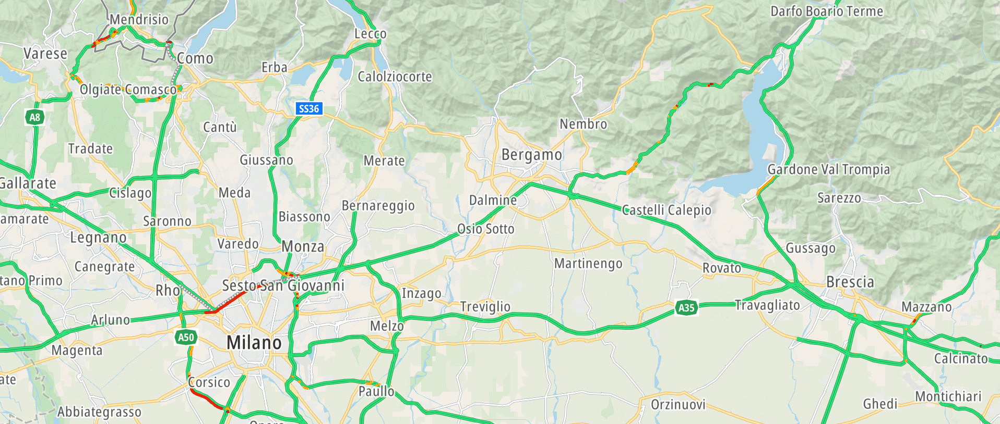

The Hillshade Module adds terrain elevation visualization to maps through semi-transparent shading that reveals hills, valleys, mountains, and other terrain features.



## Initialization

```javascript
import { TomTomMap, HillshadeModule } from '@tomtom-org/maps-sdk/map';

// Initialize map with hillshade style layer
const map = new TomTomMap(
    { container: 'map' },
    { style: { type: 'standard', include: ['hillshade'] } }
);

// Initialize Hillshade module with default configuration
const hillshade = await HillshadeModule.get(map);

// Or with custom configuration
const hillshade = await HillshadeModule.get(map, {
    visible: false,
    // Check if map was initialized with hillshade style layer, add it if missing and reload the style
    ensureAddedToStyle: true
});
```

## Visibility Control

Control hillshade visibility dynamically:

```javascript
// Show hillshade
hillshade.setVisible(true);

// Hide hillshade
hillshade.setVisible(false);

// Check current visibility
if (hillshade.isVisible()) {
    console.log('Hillshade is visible');
}

// Update visibility through config
hillshade.applyConfig({ visible: false });
hillshade.applyConfig({ visible: true });
```

## Events

Handle user interactions with hillshade:

```javascript
// Click events
hillshade.events.on('click', (feature, lngLat) => {
    console.log('Terrain clicked at:', lngLat);
});

// Hover events
hillshade.events.on('hover', (feature, lngLat) => {
    console.log('Hovering over terrain at:', lngLat);
});

// Long hover events
hillshade.events.on('long-hover', (feature, lngLat) => {
    console.log('Long hovering over terrain at:', lngLat);
});

// Context menu events
hillshade.events.on('contextmenu', (feature, lngLat) => {
    console.log('Right-clicked terrain at:', lngLat);
});

// Remove event listeners
hillshade.events.off('click', handler);
```

## API Reference

For complete documentation of all Hillshade Module properties, methods, and types, see the **[HillshadeModule API Reference](/maps-sdk-js/api-reference/classes/map.HillshadeModule.html)**.

## Related Guides and Examples

### Related Examples
- **[Hillshade](../../examples/hillshade/)** - Basic hillshade visualization and visibility control

### Related Map Modules
- **[POIs Module](./pois)** - Display points of interest alongside terrain visualization
- **[User Events](./user-events)** - Handle user interactions with map features

