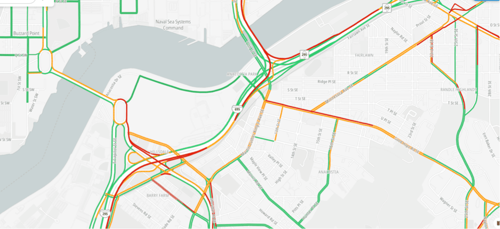

Traffic flow provides real-time observed speeds and travel times for all key roads in a network, enabling users to make informed routing decisions based on current road conditions. The visual representation uses intuitive color coding where red indicates slow traffic, yellow represents moderate speeds, and green shows free-flowing traffic.



## Overview

Traffic flow visualization displays comprehensive real-time speed data across road networks, helping users understand current traffic conditions at a glance. The system continuously updates based on observed vehicle speeds and provides coverage for major transportation corridors including highways, arterials, and urban streets.

**Key Traffic Flow Information:**
- **Real-time speed data** with color-coded indicators for instant traffic assessment
- **Road category coverage** including highways, arterials, and local streets
- **Historical speed comparisons** providing context for current conditions
- **Road closure indicators** showing blocked or restricted routes
- **Performance metrics** including current speed vs. free-flow speed ratios

**Visual Representation:**
- **Color-coded road segments** indicating traffic speed levels and congestion
- **Road closure overlays** highlighting blocked or restricted routes
- **Interactive elements** supporting click and hover events for detailed speed information

## Basic Setup

First set up your project and map following the [Map quickstart guide](/maps-sdk-js/guides/map/quickstart) and ensure you have a running [TomTomMap](/maps-sdk-js/api-reference/map-init.TomTomMap) instance.

```javascript
const map = new TomTomMap(
  { container: "map" },
  { style: { type: "standard", include: ["trafficFlow"] } }
);
```

### Advanced Traffic Flow Control

For granular control over traffic flow behavior, import and initialize the [TrafficFlowModule](/maps-sdk-js/api-reference/classes/map.TrafficFlowModule.html):

```javascript
import { TrafficFlowModule } from "@tomtom-org/maps-sdk/map";

const traffic = await TrafficFlowModule.get(map);
```

### Initialization with Configuration

Configure the module during initialization to set up specific behaviors:

```javascript
const traffic = await TrafficFlowModule.get(map, {
    visible: false,
    filters: {
        any: [{ roadCategories: { show: "only", values: ["motorway", "trunk"] } }]
    }
});
```

# Dynamic control

The Traffic Flow Module provides flexible configuration options that can be applied during initialization or modified at runtime. All configuration changes are applied seamlessly without requiring map reloads, ensuring smooth user experience.

### Applying Configuration Updates

Modify traffic flow settings dynamically while the module is active:

```javascript
const traffic = await TrafficFlowModule.get(map);

// Update configuration without affecting other settings
traffic.applyConfig({
    visible: true,
    filters: {
        any: [{ roadCategories: { show: "only", values: ["primary"] } }]
    }
});

// Resets visibility to true and removes all filters
traffic.resetConfig();
```

### Applying Common Configuration

Use specific methods for common configuration changes:

```javascript
const traffic = await TrafficFlowModule.get(map);

// Toggle overall visibility
traffic.setVisible(false);

// Apply filtering
traffic.filter({
    any: [{ roadCategories: { show: "only", values: ["motorway"] } }]
});

// Check current visibility state
if (traffic.isVisible()) {
    console.log('Traffic flow is visible');
}
```

## Advanced Traffic Flow Filtering

Traffic flow filtering provides sophisticated control over which types of traffic information are displayed. This feature enables applications to focus on specific road types, traffic conditions, or geographic criteria based on user needs or application context.

### Road Category Filtering

[Filter](/maps-sdk-js/api-reference/types/map.TrafficFlowFilter.html) traffic flow by road type to focus on specific transportation networks:

```javascript
// Show only highway traffic
traffic.filter({
    any: [{
        roadCategories: {
            show: "only",
            values: ["motorway", "trunk"]
        }
    }]
});

// Hide local streets, show major roads
traffic.filter({
    any: [{
        roadCategories: {
            show: "all_except",
            values: ["street"]
        }
    }]
});
```

**Available Road Categories:**
- **motorway**: High-speed highways and freeways
- **trunk**: Major intercity roads and expressways
- **primary**: Important regional roads and major arterials
- **secondary**: Secondary roads connecting towns and districts
- **tertiary**: Local connector roads and minor arterials
- **street**: Local streets and neighborhood roads

### Road Sub-Category Filtering

For more granular control, filter by specific road sub-categories:

```javascript
// Focus on major local roads within tertiary category
traffic.filter({
    any: [{
        roadSubCategories: {
            show: "only",
            values: ["major_local"]
        }
    }]
});
```

**Sub-Category Options:**
- **Tertiary roads**: `"connecting"`, `"major_local"`
- **Street roads**: `"local"`, `"minor_local"`

### Road Closure Filtering

Control the display of road closures to highlight or hide blocked routes:

```javascript
// Show only road closures
traffic.filter({
    any: [{
        showRoadClosures: "only"
    }]
});

// Hide road closures, show flowing traffic only
traffic.filter({
    any: [{
        showRoadClosures: "all_except"
    }]
});
```

### Complex Filter Combinations

Create sophisticated filtering logic by combining multiple criteria:

```javascript
// Show major roads OR any roads with closures
traffic.filter({
    any: [
        {
            roadCategories: {
                show: "only",
                values: ["motorway", "trunk", "primary"]
            }
        },
        {
            showRoadClosures: "only"
        }
    ]
});

// Show highway traffic with different sub-category filtering
traffic.filter({
    any: [{
        roadCategories: {
            show: "only",
            values: ["motorway", "trunk"]
        },
        roadSubCategories: {
            show: "all_except",
            values: ["local"]
        }
    }]
});
```

## Event Handling

The Traffic Flow Module provides comprehensive event handling for interactive applications:

```javascript
const traffic = await TrafficFlowModule.get(map);

// Handle traffic flow clicks
traffic.events.on('click', (feature, lngLat) => {
    ...
});

// Handle hover for quick information
traffic.events.on('hover', (feature, lngLat) => {
    ...
});

// Handle long hover for detailed information
traffic.events.on('long-hover', (feature, lngLat) => {
    ...
});
```

## API Reference

For complete documentation of all TrafficFlowModule properties, methods, and types, see the **[TrafficFlowModule API Reference](/maps-sdk-js/api-reference/classes/map.TrafficFlowModule.html)**.

## Related Guides and Examples

### Services Integration
- **[Planning a Route](../services/routing/planning-a-route.mdx)** - Calculate routes that account for current traffic conditions
- **[Search Services](../services/places/search.mdx)** - Find alternate locations when traffic affects accessibility

### Related Map Modules
- **[Traffic Incidents](./traffic-incidents.mdx)** - Display traffic incidents alongside flow information
- **[User Events](./user-events.mdx)** - Handle user interactions with traffic flow segments
- **[Routes Module](./routes.mdx)** - Display routes that utilize real-time traffic flow data

For complete traffic flow implementation examples and advanced filtering patterns, go to http://docs.tomtom.com/maps-sdk-js/examples.
