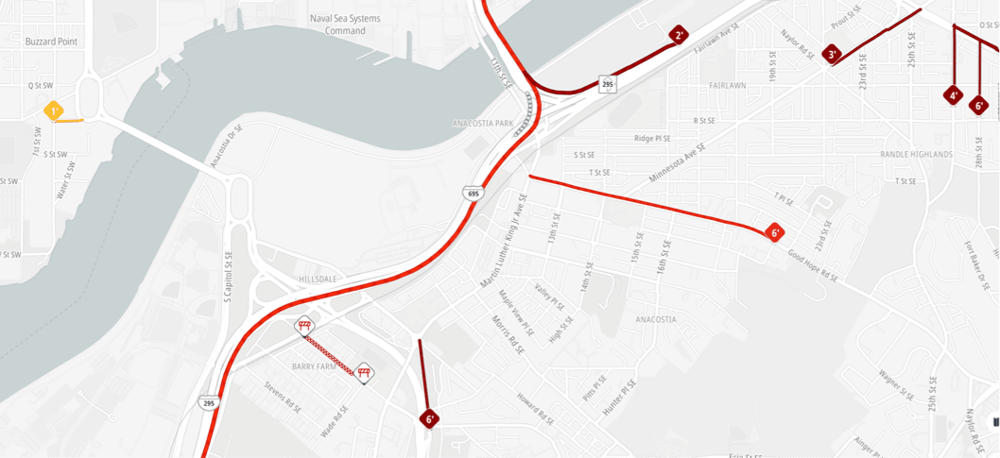

Traffic incidents provide real-time information about events affecting road conditions, including accidents, road closures, construction work, and weather-related disruptions. This data helps users understand not just where traffic problems exist, but what's causing them and their expected impact on travel times.



## Overview

Traffic incidents represent specific events that disrupt normal traffic flow, providing detailed information about the nature, severity, and expected duration of each incident. The system displays both visual indicators on the map and rich metadata that can be accessed through user interactions.

**Key Incident Information:**
- **Incident type and category** (accident, construction, weather conditions, etc.)
- **Severity levels** indicating the impact on traffic flow
- **Delay estimates** showing expected time impacts in minutes
- **Affected road segments** with precise geographic location data
- **Duration information** including start times and estimated resolution

**Visual Representation:**
- **Icon indicators** showing incident type and severity at specific locations
- **Road segment coloring** indicating affected areas and traffic impact
- **Interactive elements** supporting click and hover events for detailed information


## Basic Setup

First set up your project and map following the [Map quickstart guide](/maps-sdk-js/guides/map/quickstart) and ensure you have a running [TomTomMap](/maps-sdk-js/api-reference/map-init.TomTomMap) instance.

```javascript
const map = new TomTomMap(
  { container: "map" },
  { style: { type: "standard", include: ["trafficIncidents"] } }
);
```

### Advanced Traffic Incidents Control

For granular control over traffic incident behavior, import and initialize the [TrafficIncidentsModule](/maps-sdk-js/api-reference/classes/map.TrafficIncidentsModule.html):

```javascript
import { TrafficIncidentsModule } from "@tomtom-org/maps-sdk/map";

const incidents = await TrafficIncidentsModule.get(map);
```

### Initialization with Configuration

Configure the module during initialization to set up specific behaviors:

```javascript
const incidents = await TrafficIncidentsModule.get(map, {
    visible: false,
    icons: { visible: true },
    filters: {
        any: [{ incidentCategories: { show: "only", values: ["accident", "road_closed"] } }]
    }
});
```

# Dynamic control

The Traffic Incidents Module provides flexible configuration options that can be applied during initialization or modified at runtime. All configuration changes are applied seamlessly without requiring map reloads, ensuring smooth user experience.

### Applying Configuration Updates

Modify traffic incident settings dynamically while the module is active:

```javascript
const incidents = await TrafficIncidentsModule.get(map);

// Update configuration without affecting other settings
incidents.applyConfig({
    visible: true,
    icons: { visible: false },
    filters: {
        any: [{ magnitudes: { show: "only", values: ["major", "moderate"] } }]
    }
});

// Resets visibility to true and removes all filters
incidents.resetConfig();
```

### Applying Common Configuration

Use specific methods for common configuration changes:

```javascript
const incidents = await TrafficIncidentsModule.get(map);

// Toggle overall visibility
incidents.setVisible(false);

// Toggle icon visibility independently
incidents.setIconsVisible(true);

// Apply filtering
incidents.filter({
    any: [{ incidentCategories: { show: "only", values: ["accident"] } }]
});

// Check icon visibility specifically
if (incidents.anyIconLayersVisible()) {
    console.log('Incident icons are visible');
}
```

## Advanced Traffic Incident Filtering

Traffic incident filtering provides sophisticated control over which types of incidents are displayed. This feature enables applications to focus on specific incident types, severity levels, or impact criteria based on user needs or application context.

### Incident Category Filtering

[Filter](/maps-sdk-js/api-reference/types/map.TrafficIncidentsFilter.html) incidents by type to focus on specific kinds of disruptions:

```javascript
// Show only accidents and road closures
incidents.filter({
    any: [{
        incidentCategories: {
            show: "only",
            values: ["accident", "road_closed"]
        }
    }]
});

// Hide weather-related incidents
incidents.filter({
    any: [{
        incidentCategories: {
            show: "all_except",
            values: ["rain", "fog", "ice", "wind"]
        }
    }]
});
```

**Available Incident Categories:**
- **accident**: Vehicle collisions and crashes
- **road_closed**: Complete road closures
- **road_works**: Construction and maintenance activities
- **lane_closed**: Partial lane closures and restrictions
- **jam**: Traffic congestion and bottlenecks
- **broken_down_vehicle**: Disabled vehicles affecting traffic
- **dangerous_conditions**: Hazardous road conditions
- **flooding**: Water-related road impacts
- **fog**: Visibility-reducing weather conditions
- **rain**: Precipitation affecting driving conditions
- **ice**: Icy road conditions
- **wind**: High wind conditions affecting travel
- **unknown**: Incidents with unspecified categories

### Severity and Impact Filtering

Filter incidents based on their severity and expected impact:

```javascript
// Show only major incidents
incidents.filter({
    any: [{
        magnitudes: {
            show: "only",
            values: ["major"]
        }
    }]
});

// Show major and moderate incidents, hide minor
incidents.filter({
    any: [{
        magnitudes: {
            show: "only",
            values: ["major", "moderate"]
        }
    }]
});
```

**Severity Levels:**
- **major**: Significant impact on traffic flow with substantial delays
- **moderate**: Noticeable impact with moderate delays
- **minor**: Limited impact with minimal delays
- **unknown**: Incidents with undetermined impact levels
- **indefinite**: Unknown or extremely long delay (e.g., road closure)

### Delay-Based Filtering

Filter incidents based on their expected delay impact:

```javascript
// Show only incidents causing delays
incidents.filter({
    any: [{
        delays: {
            mustHaveDelay: true
        }
    }]
});

// Show incidents with significant delays (10+ minutes)
incidents.filter({
    any: [{
        delays: {
            minDelayMinutes: 10
        }
    }]
});

// Show incidents with major delays or no delay information
incidents.filter({
    any: [{
        delays: {
            minDelayMinutes: 15,
            mustHaveDelay: false
        }
    }]
});
```

### Road Category Filtering

Apply the same road category filtering available in traffic flow:

```javascript
// Show incidents only on major highways
incidents.filter({
    any: [{
        roadCategories: {
            show: "only",
            values: ["motorway", "trunk"]
        }
    }]
});
```

### Separate Icon and Line Filtering

Apply different filters to incident icons and road segment indicators:

```javascript
// Show all incident road coloring, but only major incident icons
incidents.filter(
    undefined, // No filtering on road segments
    { any: [{ magnitudes: { show: "only", values: ["major"] } }] } // Filter icons
);

// Filter road segments and icons differently
incidents.filter(
    { any: [{ roadCategories: { show: "only", values: ["motorway"] } }] }, // Roads
    { any: [{ incidentCategories: { show: "only", values: ["accident"] } }] } // Icons
);
```

## Event Handling

The Traffic Incidents Module provides comprehensive event handling for interactive applications:

```javascript
const incidents = await TrafficIncidentsModule.get(map);

// Handle incident clicks
incidents.events.on('click', (feature, lngLat) => {
    ...
});

// Handle hover for quick information
incidents.events.on('hover', (feature, lngLat) => {
    ...
});

// Handle long hover for detailed information
incidents.events.on('long-hover', (feature, lngLat) => {
    ...
});
```
## API Reference

For complete documentation of all TrafficIncidentsModule properties, methods, and types, see the **[TrafficIncidentsModule API Reference](/maps-sdk-js/api-reference/classes/map.TrafficIncidentsModule.html)**.

## Related Guides and Examples

### Services Integration
- **[Planning a Route](../services/routing/planning-a-route.mdx)** - Calculate routes that avoid traffic incidents and account for delays
- **[Search Services](../services/places/search.mdx)** - Find alternate locations when incidents affect original destinations

### Related Map Modules
- **[Traffic Flow](./traffic-flow.mdx)** - Visualize traffic flow data alongside incident information
- **[User Events](./user-events.mdx)** - Handle user interactions with traffic incident markers and popups
- **[Routes Module](./routes.mdx)** - Display routes that account for traffic incidents and delays

For complete traffic incident implementation examples and advanced filtering patterns, go to http://docs.tomtom.com/maps-sdk-js/examples.

