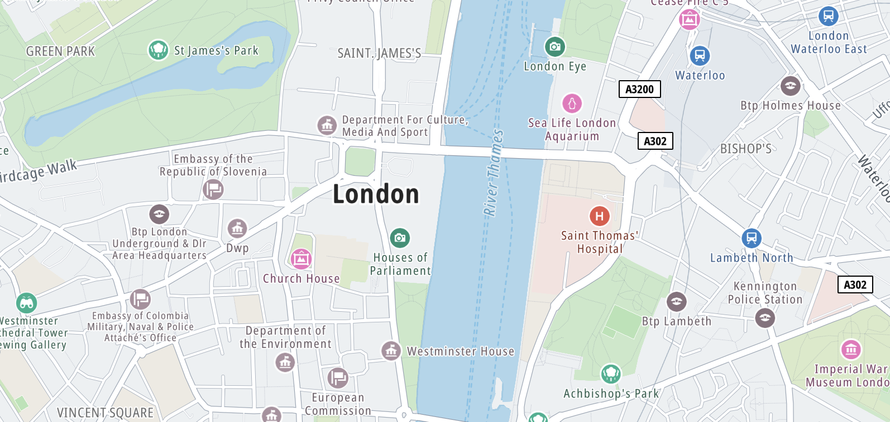

Map style is used to define the look and feel of a map. It’s written in JSON format and specifies how to:

-   Style the symbols, lines, polygons, background, hill shading, heatmap points, raster tiles, circles, and extruded polygons.
-   Specify which of them should be drawn.
-   Set the order in which to draw them.

<Blockquote>

  The structure of the map style can be found in the [Map Style Specification](https://developer.tomtom.com/map-display-api/documentation/mapstyles/map-style-specification) documentation.

</Blockquote>

Different applications may require different styles, so map visualisation can be aligned with brand identity or with specific use cases.
For example, the map in a tourist app will show POIs like museums and restaurants, while a truck navigation app will include road shields.
The Map Display module comes with two pre-defined styles, but it also supports loading custom styles.

{<a style={{display: 'block', margin: '0', padding: '0'}} id="_pre_defined_styles"></a>}

# Pre-defined styles

The Map Display module provides pre-defined styles that can be used in the application.
They are provided in the [`StyleInput`](/maps-sdk-js/javascript/maps/documentation/api-reference/modules/map_init#StyleInput) as [`PublishedStyle`](/maps-sdk-js/javascript/maps/documentation/api-reference/modules/map_init#PublishedStyle).
A [`PublishedStyle`](/maps-sdk-js/javascript/maps/documentation/api-reference/modules/map_init#PublishedStyle) represents a style which is officially hosted by TomTom and easily accessible by its name.

The available [`PublishedStyle`](/maps-sdk-js/javascript/maps/documentation/api-reference/modules/map_init#PublishedStyle) are:

-   `standardLight` and `standardDark` - Styles made for browsing the map in light and dark mode respectively. The `standardLight` style is the default style used by the Map Display module.
-   `drivingLight` and `drivingDark` - Styles to use during navigation in light and dark mode respectively. These styles render routes in gray and show traffic flow and road shields.
-   `satellite` - This style uses satellite imagery to draw the map.
-   `monoLight`

These styles are showcased in the [Map Config Playground](https://hosted-examples.maps-sdk-js.tomtom.com/main/map-config-playground/) example.

{<a style={{display: 'block', margin: '0', padding: '0'}} id="_loading_a_style"></a>}

# Loading a style

The style can be loaded when the map is initialized by specifying the `style` property of
the [`GOSDKMapParams`](/maps-sdk-js/javascript/maps/documentation/api-reference/modules/map_init#GOSDKMapParams) when initializing
an instance of [`GOSDKMap`](/maps-sdk-js/javascript/maps/documentation/api-reference/classes/map_init.GOSDKMap).

```javascript
import { GOSDKMap } from "@anw/go-sdk-js/map";

const goSDKMap = new GOSDKMap(
    {
        // Container element defined in the corresponding HTML file
        container: "map",
        zoom: 14,
        minZoom: 2,
        center: [-0.12621, 51.50394]
    },
    {
        style: "standardDark"
    }
);
```

Additionally, you can change the style of the map at runtime using the [`setStyle`](/maps-sdk-js/javascript/maps/documentation/api-reference/classes/map_init.GOSDKMap#setStyle) method on the GOSDKMap class.

```javascript
goSDKMap.setStyle("drivingDark");
```

{<a style={{display: 'block', margin: '0', padding: '0'}} id="_customizing_a_style"></a>}

# Customizing a style

You can also create your own style to suit your application.

<Blockquote hasIcon>

  The easiest way to do this is to use the [Map Styler](https://developer.tomtom.com/maps-api/map-styler). It provides a user interface with real-time previews so you can see the effects of your changes.

</Blockquote>

Custom styles can be provided to the application in the [`StyleInput`](/maps-sdk-js/javascript/maps/documentation/api-reference/modules/map_init#StyleInput)
as a [`CustomStyle`](/maps-sdk-js/javascript/maps/documentation/api-reference/modules/map_init#CustomStyle).

{<a style={{display: 'block', margin: '0', padding: '0'}} id="_excluding_modules_from_a_style"></a>}

# Excluding modules from a style

When setting the map style, you can exclude modules from the loaded map style with the `exclude` property in [`GOSDKMapParams`](/maps-sdk-js/javascript/maps/documentation/api-reference/modules/map_init#GOSDKMapParams).
For example, excluding [hill shading](/maps-sdk-js/javascript/maps/documentation/guides/map-display/map-styles#_adding_hill_shading) and [traffic flow](/maps-sdk-js/javascript/maps/documentation/guides/map-display/traffic) from the map style:

```javascript
import { GOSDKMap } from "@anw/go-sdk-js/map";

const goSDKMap = new GOSDKMap(
    {
        // Container element defined in the corresponding HTML file
        container: "map",
        zoom: 14,
        minZoom: 2,
        center: [-0.12621, 51.50394]
    },
    {
        style: {
          type: "published",
          exclude: ["hillshade", "traffic_flow"]
        }
    }
);
```

{<a style={{display: 'block', margin: '0', padding: '0'}} id="_adding_and_filtering_POIs"></a>}

# Adding and filtering Points of Interest

The styles from the Map Display module contain a Points of Interest (POIs) layer. This layer is enabled by default, but can be excluded from the
map style with the `exclude` property of the [`GOSDKMapParams`](/maps-sdk-js/javascript/maps/documentation/api-reference/modules/map_init#GOSDKMapParams).

The POI layer visibility can be controlled during runtime with the [`VectorTilePOIs`](/maps-sdk-js/javascript/maps/documentation/api-reference/classes/map_POIs.VectorTilePOIs) module.

```javascript
import { VectorTilePOIs } from "@anw/go-sdk-js/map";

const pois = await VectorTilePOIs.init(goSDKMap);
pois.setVisible(false);
```



<br/>

It's also possible to filter shown POIs by category or classification group using the `filterCategories()` method on [`VectorTilePOIs`](/maps-sdk-js/javascript/maps/documentation/api-reference/classes/map_POIs.VectorTilePOIs).
See the [Map POI filters](http://hosted-examples.maps-sdk-js.tomtom.com/main/map-poi-filters) example for this functionality.

{<a style={{display: 'block', margin: '0', padding: '0'}} id="_adding_hill_shading"></a>}

# Adding hill shading

The Map Display module allows you to add style layers such as hill shading to the map style.


<br/>

Hill shading is enabled by default. It can be excluded from the map style with the `exclude` property of the [`GOSDKMapParams`](/maps-sdk-js/javascript/maps/documentation/api-reference/modules/map_init#GOSDKMapParams).

To show or hide hill shading on runtime, use the [`VectorTilesHillshade`](/maps-sdk-js/javascript/maps/documentation/api-reference/classes/map_hillshade.VectorTilesHillshade) class:

``` javascript
const hillshade = await VectorTilesHillshade.init(goSDKMap);
hillshade.setVisible(false);
```

{<a style={{display: 'block', margin: '0', padding: '0'}} id="_next_steps"></a>}

# Next steps

Since you have learned how to style a map, here are recommendations for the next steps:

-   [Drawing shapes on the map](/maps-sdk-js/javascript/maps/documentation/guides/map-display/overlays)
-   [Manipulating the camera position](/maps-sdk-js/javascript/maps/documentation/guides/map-display/camera-and-animations)
-   [Using events and gestures](/maps-sdk-js/javascript/documentation/guides/map-display/events-and-gestures)
