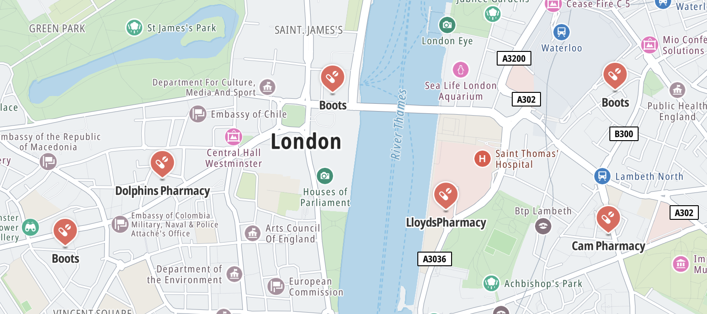

Markers are used to indicate specific places on the map. The Map Display SDK provides a default icon, but a custom icons can be used as well.

> For creating markers directly on the MapLibre [`Map`](https://maplibre.org/maplibre-gl-js-docs/api/map/), see [MapLibre Markers and controls](https://maplibre.org/maplibre-gl-js-docs/api/markers/).

# Showing Places on the map

The [`GeoJSONPlaces`](/maps-sdk-js/javascript/maps/documentation/api-reference/classes/map_places.GeoJSONPlaces) module is used to show
[`Places`](/maps-sdk-js/javascript/maps/documentation/api-reference/modules/core#Places) on the map, which are returned from the services of the Services module.
For example, showing places from a Search result:

> Make sure you have an initialized [`GOSDKMap`](/maps-sdk-js/javascript/maps/documentation/api-reference/classes/map_init.GOSDKMap) instance in your project.
Read more about initializing the map in the [Quickstart](/maps-sdk-js/javascript/maps/documentation/guides/map-display/quickstart) guide.

```javascript
import { GeoJSONPlaces } from "@anw/go-sdk-js/map";
import { search } from "@anw/go-sdk-js/services";

const placesModule = await GeoJSONPlaces.init(goSDKMap);

const places = await search({
    query: "pharmacy",
    limit: 35,
    boundingBox: goSDKMap.getBounds()
});

placesModule.show(places);
```



<br/>

{<a style={{display: 'block', margin: '0', padding: '0'}} id="_customizing_icons"></a>}

# Customizing icons (WIP)

You can customize the Places marker icons in the `GeoJSONPlaces` module
using the [`applyIconConfig()`](/maps-sdk-js/javascript/maps/documentation/api-reference/classes/map_places.GeoJSONPlaces#applyConfig) method.
See the [Map Places Customize](http://hosted-examples.maps-sdk-js.tomtom.com/main/map-places-customize) example.

{<a style={{display: 'block', margin: '0', padding: '0'}} id="_next_steps"></a>}

# Next steps

Since you have learned how to work with markers and places, here are recommendations for the next steps:

-   [Example: Map Places Customize](http://hosted-examples.maps-sdk-js.tomtom.com/main/map-places-customize)
-   [Map overlays](/maps-sdk-js/javascript/maps/documentation/guides/map-display/overlays)
-   [Showing traffic on the map](/maps-sdk-js/javascript/maps/documentation/guides/map-display/traffic)
-   [Showing routes on the map](/maps-sdk-js/javascript/maps/documentation/guides/map-display/routes)
