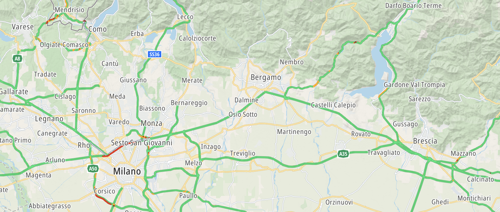
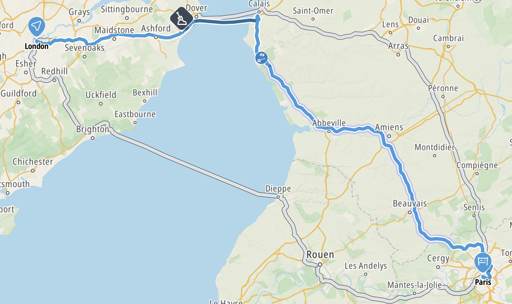

The Map Display module allows you to handle route planning and driving actions on the map. This guide covers how to draw [`Routes`](/maps-sdk-js/javascript/maps/documentation/api-reference/modules/core#Routes) and [`Waypoints`](/maps-sdk-js/javascript/maps/documentation/api-reference/modules/core#Waypoints).

<Blockquote>

  This guide does not cover how routes are planned or waypoints are created. See the [Routing guide](/maps-sdk-js/javascript/maps/documentation/guides/routing/planning-a-route)
  and [Waypoints and reconstruction routes](/maps-sdk-js/javascript/maps/documentation/guides/routing/waypoints-and-reconstruction-routes)
  for the relevant guides.

</Blockquote>

{<a style={{display: 'block', margin: '0', padding: '0'}} id="_adding_a_route"></a>}

# Adding a route

To show [`Routes`](/maps-sdk-js/javascript/maps/documentation/api-reference/modules/core#Routes) on the map, make sure your API key is enabled
and an instance of [`GOSDKMap`](/maps-sdk-js/javascript/maps/documentation/api-reference/classes/map.GOSDKMap) is initialized,
then the [`RoutingModule`](/maps-sdk-js/javascript/maps/documentation/api-reference/classes/map.RoutingModule) class can be used to show routes and waypoints.

```javascript
import { RoutingModule } from "@anw/go-sdk-js/map";
import { calculateRoute } from "@anw/go-sdk-js/services";

// Given an array of `Waypoint`
const waypoints = ...

const routingModule = await RoutingModule.init(goSDKMap);
routingModule.showWaypoints(waypoints);
routingModule.showRoutes(await calculateRoute({ geoInputs: waypoints }));
```



<br/>

All routes and waypoints added to the map can be removed using the `clearRoutes()` and `clearWaypoints()` methods.

```javascript
routingModule.clearRoutes();
routingModule.clearWaypoints();
```

Between the shown routes, one of the routes can be selected and highlighted using the `selectRoute()` method.

```javascript
routingModule.selectRoute(index);
```



{<a style={{display: 'block', margin: '0', padding: '0'}} id="_next_steps"></a>}

# Next steps

Since you have learned how to work with routes on the map, here are recommendations for the next steps:

-   [Example: Map route](https://hosted-examples.maps-sdk-js.tomtom.com/main/map-route)
-   [Example: Map route with alternatives](https://hosted-examples.maps-sdk-js.tomtom.com/main/map-route-with-alternatives)
-   [Example: Map route reconstruction playground](https://hosted-examples.maps-sdk-js.tomtom.com/main/map-route-reconstruction-playground)
-   [Map overlays](/maps-sdk-js/javascript/maps/documentation/guides/map-display/overlays)
-   [Showing traffic on the map](/maps-sdk-js/javascript/maps/documentation/guides/map-display/traffic)
