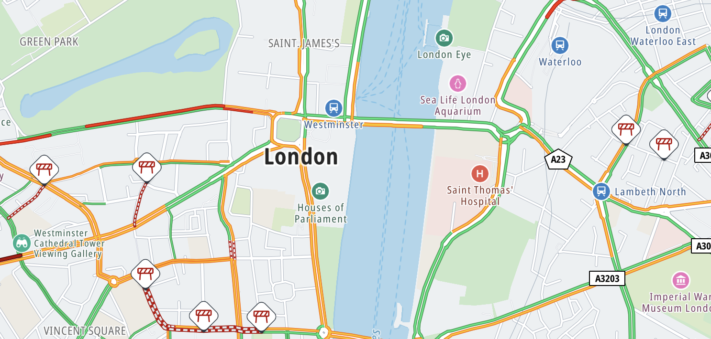

The TomTom Map Display module provides real-time traffic updates. You can show this on the map by adding a layer with
traffic flow and a layer with traffic incidents.

{<a style={{display: 'block', margin: '0', padding: '0'}} id="_traffic_flow_and_incidents"></a>}

# Traffic flow and incidents

The traffic flow layer shows congestion on the main route network and the traffic incidents layer shows incidents on the roads, like road closures and roadworks.
These traffic layers are visible by default in the standard map styles and can be controlled at runtime by the [`VectorTilesTraffic`](/maps-sdk-js/javascript/maps/documentation/api-reference/classes/map.VectorTilesTraffic)
module.



<br/>

> If these layers are unnecessary in your application, they can be completely excluded from the map style through the [`exclude`](/maps-sdk-js/javascript/maps/documentation/guides/map-display/map-styles#_excluding_modules_from_a_style) property in `GOSDKMapParams`.

The [`VectorTilesTraffic`](/maps-sdk-js/javascript/maps/documentation/api-reference/classes/map.VectorTilesTraffic) module can be initialized with:

> Make sure you have an initialized [`GOSDKMap`](/maps-sdk-js/javascript/maps/documentation/api-reference/classes/map.GOSDKMap) instance in your project.
Read more about initializing the map in the [Quickstart](/maps-sdk-js/javascript/maps/documentation/guides/map-display/quickstart) guide.

```javascript
import { VectorTilesTraffic } from "@anw/go-sdk-js/map";

const traffic = await VectorTilesTraffic.init(goSDKMap);
```

Then, several methods on the [`VectorTilesTraffic`](/maps-sdk-js/javascript/maps/documentation/api-reference/classes/map.VectorTilesTraffic) module
can be used change the visibility of the traffic layers. For example:

```javascript
// Show traffic incidents without their icons.
traffic.setIncidentsVisible(true);
traffic.setIncidentIconsVisible(false)
```
More methods can be found on the API reference definition of [`VectorTilesTraffic`](/maps-sdk-js/javascript/maps/documentation/api-reference/classes/map.VectorTilesTraffic).

# Filtering traffic (WIP)

The [`VectorTilesTraffic`](/maps-sdk-js/javascript/maps/documentation/api-reference/classes/map.VectorTilesTraffic) module
allows specific filtering of traffic flow and incidents. The module can use a [`VectorTilesTrafficConfig`](/maps-sdk-js/javascript/maps/documentation/api-reference/modules/map#VectorTilesTrafficConfig)
object to precisely filter the visibility of certain traffic flow and incidents. See the `applyConfig` method and the [Map Traffic Config Playground](https://hosted-examples.maps-sdk-js.tomtom.com/main/map-traffic-config-playground) example.

{<a style={{display: 'block', margin: '0', padding: '0'}} id="_next_steps"></a>}

# Next steps

Since you have learned how to show and filter traffic on the map, here are recommendations for the next steps:

-   [Example: Map Traffic Config Playground](https://hosted-examples.maps-sdk-js.tomtom.com/main/map-traffic-config-playground)
-   [Drawing shapes on the map](/maps-sdk-js/javascript/maps/documentation/guides/map-display/overlays)
-   [Adding a marker to the map](/maps-sdk-js/javascript/maps/documentation/guides/map-display/markers)
-   [Showing and following routes on the map](/maps-sdk-js/javascript/maps/documentation/guides/map-display/routes)
