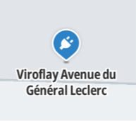
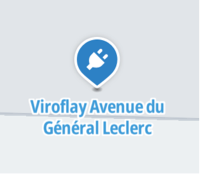
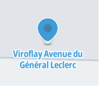

The Places module allows you to display places modelled as GeoJSON features on the map and interact with them.
It provides out of the box styling and interaction capabilities for TomTom places on the map.
However, you still can configure how to display the places, and also display them from your own data.

# When all you need is a map with one or few pins

Very often all you need to do is to show a map with a single pin without a label, or perhaps a handful of icons which won't change often. For that you might directly try to add [Markers](https://maplibre.org/maplibre-gl-js-docs/api/markers/) via MapLibre.
See [default marker example](https://maplibre.org/maplibre-gl-js-docs/example/add-a-marker/) and
[add popup to marker instance example](https://maplibre.org/maplibre-gl-js-docs/example/set-popup/)

However, if you want to easily show TomTom places, or show your own places with richer display information and solid user events which also work well with other map parts, keep reading.

# Initializing a Places module

You can add one or multiple Places modules to your map, each with its own configuration.

The places from each module will be layered on top of places from the module added before.

* First Set up your project and map following the [Map quickstart guide](/javascript/maps/documentation/guides/map/quickstart)
* Make sure to have a running [TomTomMap](/javascript/maps/documentation/api-reference/map-init.TomTomMap) instance.
* Import the Places module class:
```javascript
import { PlacesModule } from "@anw/maps-sdk-js/map";
```
* Initialize a Places module (default config):
```javascript
const placesModule = await PlacesModule.init(map);
```
* Optionally, [configure your module](#configuring-a-places-module) in the step above

# Showing Places on the map

The Places Module is used to show [`Places`](/javascript/maps/documentation/api-reference/core#Places) on the map,
which are returned from the services of the Services module.
For example, showing places from a search result:

```javascript
import { search } from "@anw/maps-sdk-js/services";
import { PlacesModule } from "@anw/maps-sdk-js/map";
// ensure "map" is initialized as your TomtomMap (see map quickstart guide)
const places = await search({ query: "pharmacy", limit: 35, boundingBox: map.getBounds()});
const placesModule = await PlacesModule.init(map);
placesModule.show(places);
```


<br/>

# Interacting with Places on the map

With the SDK you can easily listen to key user events for Places without worrying if the events overlap with other SDK layers.

To understand how the SDK deals with user events, read the [user events guide](/javascript/maps/documentation/guides/map/user-events) first.

The first parameter of event callbacks will be the top Place that got the event.
<br/>

Registering to user events:
```javascript
import { Place } from "@anw/maps-sdk-js/core";
import { PlacesModule } from "@anw/maps-sdk-js/map";
// ensure "map" is initialized as your TomtomMap (see map quickstart guide)
const placesModule = await PlacesModule.init(map);
placesModule.events.on("hover", (place: Place) => console.log(`hover: ${JSON.stringify(place)}`));
placesModule.events.on("long-hover", (place: Place) => console.log(`long-hover: ${JSON.stringify(place)}`));
placesModule.events.on("click", (place: Place) => console.log(`click: ${JSON.stringify(place)}`));
placesModule.events.on("contextmenu", (place: Place) => console.log(`contextmenu: ${JSON.stringify(place)}`));
```

When you listen to Places events, the SDK will automatically apply [`eventState`](/javascript/maps/documentation/api-reference/map-shared#SupportsEvents)
with the occurred event to the Place feature properties on the map.

The SDK applies then default styling based on such properties.
<div style={{display: "flex"}}>
	<div style={{marginRight: 36}}>
		
		*Default pin*
	</div>
	<div style={{marginRight: 36}}>
		
		*Hovered pin*
	</div>
	<div>
		
		*Clicked pin*
	</div>
</div>
You can change such default styling if you want.
<br/>

# Configuring a Places module

You can customize how you want to display places in different ways.

>Coming soon
<br/>

## Customizing icons

You can customize the Places icons in the `PlacesModule` module
using the [`applyIconConfig`](/javascript/maps/documentation/api-reference/map-places.PlacesModule#applyConfig) method.
See the [Places Customization](http://hosted-examples.maps-sdk-js.tomtom.com/main/map-places-customize) example.
<br/>

## Customizing text

>Coming soon
