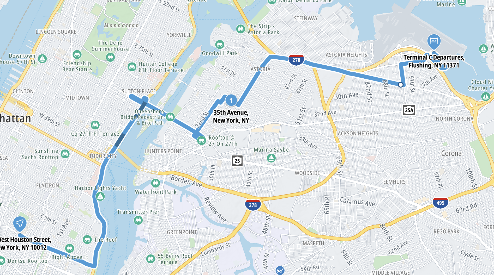

The Map bundle allows you to handle route planning and driving actions on the map. This guide covers how to draw [`Routes`](/javascript/maps/documentation/api-reference/core#Routes)
and [`Waypoints`](/javascript/maps/documentation/api-reference/core#Waypoints) on the map.

<Blockquote>

  This guide does not cover how routes are planned or waypoints are created. See the [Routing guide](/javascript/maps/documentation/guides/routing/planning-a-route)
  and [Waypoints and reconstruction routes](/javascript/maps/documentation/guides/routing/waypoints-and-reconstruction-routes)
  for the relevant guides.

</Blockquote>

{<a style={{display: 'block', margin: '0', padding: '0'}} id="_adding_a_route"></a>}

# Adding a route

To show [`Routes`](/javascript/maps/documentation/api-reference/core#Routes) on the map, make sure your API key is enabled
and an instance of [`TomTomMap`](/javascript/maps/documentation/api-reference/map-init.TomTomMap) is initialized,
then the [`RoutingModule`](/javascript/maps/documentation/api-reference/map-routes.RoutingModule) class can be used to show routes and waypoints.

> Make sure you have an initialized [`TomTomMap`](/javascript/maps/documentation/api-reference/map-init.TomTomMap) instance in your project.
Read more about initializing the map in the [Quickstart](/javascript/maps/documentation/guides/map/quickstart) guide.

```javascript
import { RoutingModule } from "@anw/maps-sdk-js/map";
import { calculateRoute } from "@anw/maps-sdk-js/services";

// Given an array of `Waypoint`
const waypoints = ...

const routingModule = await RoutingModule.init(map);
routingModule.showWaypoints(waypoints);
routingModule.showRoutes(await calculateRoute({ geoInputs: waypoints }));
```



{<a style={{display: 'block', margin: '0', padding: '0'}} id="_removing_routes"></a>}

# Removing routes

All routes and waypoints added to the map can be removed using the `clearRoutes()` and `clearWaypoints()` methods.

```javascript
routingModule.clearRoutes();
routingModule.clearWaypoints();
```

{<a style={{display: 'block', margin: '0', padding: '0'}} id="_highlighting_routes"></a>}

# Highlighting routes

Between the shown routes, one of the routes can be selected and highlighted using the `selectRoute()` method.

```javascript
routingModule.selectRoute(index);
```


