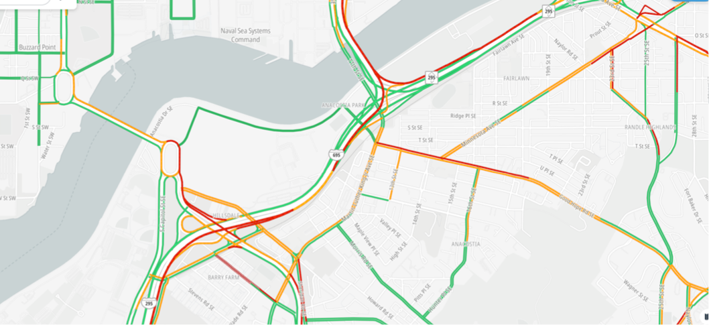

# Introduction
The TomTom Map bundle provides real-time traffic updates. They can be displayed on the map overall, or along calculated routes.

There are two types of traffic:

**Traffic incidents**: Provides an accurate view about traffic jams and incidents on the road network.

 

**Traffic flow**: Provides real time observed speeds and travel times for all key roads in a network.

 

With the TomTom SDK you can:
* show overall incidents and flow separately or together on the map
* show incidents specific to calculated routes
* configure what traffic you want to see in detail
* let users interact with traffic and see its details
 

# Initializing a map with traffic
>Coming soon...

# Traffic along routes

The SDK can show traffic incidents along routes. To do so, you must have initialized the map with **incidents** in the style.

To further learn about traffic **along a route**, refer to the [routing](/javascript/maps/documentation/guides/routes) guide.
 

# The Traffic Incidents and Flow modules

The [`TrafficIncidentsModule`](/javascript/maps/documentation/api-reference/map-traffic.TrafficIncidentsModule)
and [`TrafficFlowModule`](/javascript/maps/documentation/api-reference/map-traffic.TrafficFlowModule)
are [map-style based modules](/javascript/maps/documentation/guides/map/quickstart#map-style---based-modules)
and control the display and interactivity of live traffic on the map.

  

